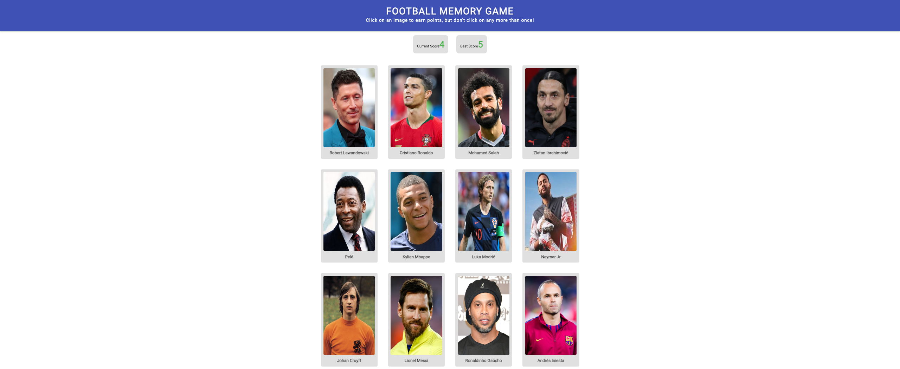

# Memory Card Game

The Memory Card Game is a web-based game where players test their memory skills by matching pairs of football (soccer) player cards. The objective is to find all the matching pairs by flipping cards and remembering their positions.

This project aims to provide an entertaining and challenging gaming experience while showcasing the use of modern web technologies.

## Live Demo
You can play the game by accessing the live demo [here](). Have fun testing your memory skills!

## Tech Stack
The project is built using the following technologies:

- **React**: A JavaScript library for building user interfaces.
- **HTML**: The standard markup language for web pages.
- **CSS**: A styling language used to enhance the visual appearance of the game.
- **JavaScript**: The programming language used to add interactivity and logic to the game.
- **Git**: A version control system for tracking changes and collaborating on the project.

## Approach
The project follows a component-based architecture using React, which helps in organizing and managing the game's UI components. The gameboard is dynamically generated using a grid layout, and each card is represented as a separate component.

Key steps in building the game include:

1. Setting up the project structure and installing necessary dependencies.
2. Designing and implementing the game's UI components, such as the header, scoreboard, and gameboard.
3. Implementing the game logic, including card flipping, matching, and score tracking.
4. Styling the game components using CSS to create an attractive and user-friendly interface.
5. Testing and fine-tuning the game to ensure smooth gameplay and optimal performance.

## Challenges
While working on this project, several challenges were encountered, including:

- **Memory management**: Implementing the logic to handle card flipping, tracking matched pairs, and resetting the game state required careful consideration and efficient memory management.
- **Responsive design**: Creating a responsive layout that adapts to different screen sizes and devices while maintaining an optimal gaming experience posed a challenge.
- **Gameplay flow**: Ensuring smooth user interactions and providing feedback on correct and incorrect matches while maintaining game flow and progression required thoughtful planning and testing.
